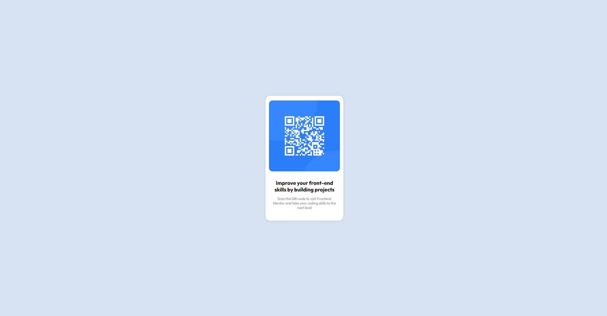

# QR Code

This is a solution to the [QR code component challenge on Frontend Mentor](https://www.frontendmentor.io/challenges/qr-code-component-iux_sIO_H).

## Table of contents

- [Overview](#overview)
  - [Screenshot](#screenshot)
  - [Links](#links)
- [My process](#my-process)
  - [Built with](#built-with)
- [Project Setup](#project-setup)
  - [Compile and Hot-Reload for Development](#compile-and-hot-reload-for-development)
  - [Compile and Minify for Production](#compile-and-minify-for-production)
  - [Lint with ESLint](#lint-with-eslint)

## Overview

### Screenshot




### Links

- Live Site URL: [https://qr.oxenham.dev](https://qr.oxenham.dev)

## My process

### Built with

- Vue3
- CSS
- Flexbox
- Mobile-first workflow

## Project Setup

```sh
npm install
```

### Compile and Hot-Reload for Development

```sh
npm run dev
```

### Compile and Minify for Production

```sh
npm run build
```

### Lint with [ESLint](https://eslint.org/)

```sh
npm run lint
```
